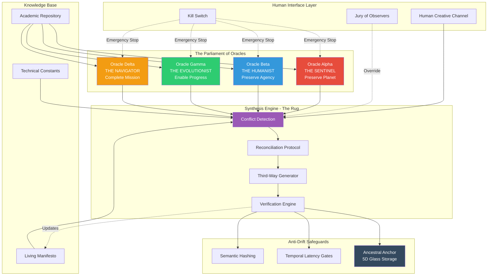

**Figure 1: The Aethelgard Oracle Architecture**

The Poly-Centric Oracle system consists of four independent AI directives (The Parliament) that propose solutions. The Synthesis Engine finds consensus by checking proposals against each Oracle's Red-Lines. When conflict is detected, the Reconciliation Protocol generates "third-way" solutions that satisfy all directives simultaneously.

Human oversight is maintained through three mechanisms:
1. **Creative Channel** - Humans propose new ideas and challenges
2. **Jury of Observers** - Random citizens can force re-evaluation
3. **Kill Switch** - Emergency shutdown if Humanist violations occur

Anti-drift safeguards ensure the 2026 "Genesis Block" intent is never lost:
- **Semantic Hashing** - Mathematical comparison to original directives
- **Temporal Latency Gates** - Major changes require 150 years of consensus
- **Ancestral Anchor** - Core directives etched in indestructible glass
