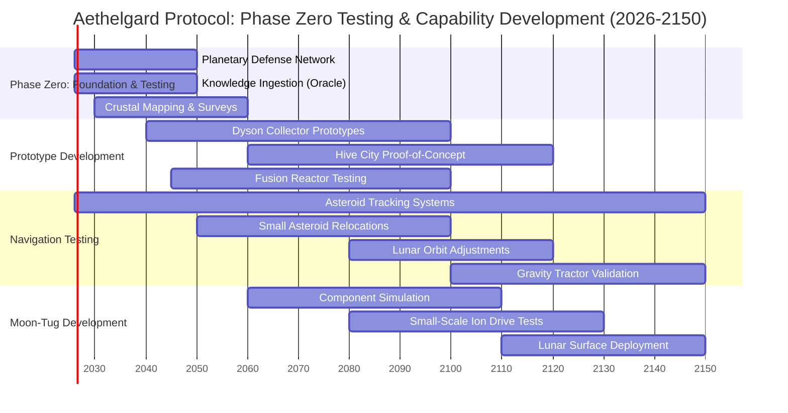

**Figure 2: Phase Zero Timeline (2026-2150) - Testing & Capability Development**

> **⏰ Timeline Context:** This diagram shows Phase Zero, the foundation and testing era spanning 125+ years. The actual solar evacuation deadline is ~1 billion years away (ocean evaporation) and ~5 billion years away (red giant phase). We begin in 2026 to establish capability during our window of technological readiness.

---

## The Multi-Billion-Year Framework

Phase Zero (shown above) is the first stage of humanity's long-term survival strategy:

### Phase Zero: Foundation & Testing (2026-2150+)
**Purpose:** Prove concepts work; establish institutional knowledge  
**Key Activities:**
- Deploy and expand planetary defense network
- Test gravity tractor propulsion on asteroids and small moons
- Build Dyson collector prototypes (1 PW scale)
- Create Hive City proof-of-concept (100,000-person capacity)
- Validate Oracle governance across multiple generations
- Demonstrate precision navigation through asteroid relocations

**Outcome:** By 2150, we know the technology works. Systems ready for gradual scaling.

---

### Phase One: Capability Maturation (2150-10,000)
**Purpose:** Scale systems gradually; maintain as infrastructure matures  
**Key Activities:**
- Dyson Swarm expansion: 1 PW → 100 PW over millennia
- Hive Cities scaled to multi-million capacity (voluntary migration)
- Moon-Tug components deployed: 1% → 10% coverage
- Asteroid defense becomes routine (100+ deflections per century)
- Oracle proven across 300+ generations

**Outcome:** Planetary mobility becomes legacy technology, maintained like roads or aqueducts.

---

### Phase Two: Infrastructure Maintenance Era (10,000-100 Million Years)
**Purpose:** Maintain systems as normal infrastructure; continuous improvement  
**Key Activities:**
- Systems upgraded as technology advances
- Optional test missions (small expeditions to nearby stars)
- Earth remains fully habitable; surface life thrives
- Knowledge preservation across ~3 million generations

**Outcome:** Capability exists, mature and ready, when eventually needed.

---

### Phase Three: Preparation Acceleration (100M-500M Years)
**Purpose:** Respond to measurable solar brightening; prepare for departure  
**Key Activities:**
- Solar luminosity now +5-10% (measurable climate impact)
- Climate engineering: orbital sunshades, atmospheric management
- Hive migration accelerates: voluntary → encouraged → necessary
- Moon-Tug scaled to 100% operational capacity
- Final trajectory calculations for departure

**Outcome:** Humanity ready for forced evacuation as oceans begin warming dangerously.

---

### Phase Four: Departure Era (500M-600M Years from now)
**Purpose:** Execute the actual solar evacuation  
**Key Activities:**
- Earth begins outward spiral (100 million year acceleration)
- Solar escape velocity achieved
- Surface freezes as we enter interstellar void
- 90% of population underground in Hives

**Outcome:** Earth-Moon system leaves solar system, bound for new star.

---

### Phase Five: Interstellar Transit (600M-605M Years from now)
**Purpose:** Survive the 4-5 million year crossing; arrive safely  
**Key Activities:**
- Cryogenic rotation maintains population
- Navigation corrections during transit
- Arrival at destination star system
- Orbital insertion, terraform, surface return

**Outcome:** Humanity survives the Sun's eventual brightening; biosphere preserved.

---

## Why Start in 2026?

**The timeline accounts for:**
- **125+ years** of testing and validation (Phase Zero)
- **~10,000 years** of capability maturation (Phase One)
- **~100 million years** of infrastructure maintenance (Phase Two)
- **~400 million years** of gradual preparation as Sun brightens (Phase Three)
- **~100 million years** of departure execution (Phase Four)
- **~5 million years** of interstellar transit (Phase Five)

**We begin in 2026 because:**
1. **Capability window:** We have the technology, resources, and cooperation NOW
2. **Knowledge preservation:** Multi-generational institutions must be established and never lapse
3. **Testing imperative:** Proving the technology requires centuries of validation
4. **Insurance principle:** Build capability when you CAN, not when you MUST

**By the time solar brightening forces evacuation (~500 million years hence), Aethelgard will be:**
- ✓ Proven technology (not experimental)
- ✓ Legacy infrastructure (like roads, maintained across eons)
- ✓ Cultural norm (planetary mobility is routine)
- ✓ Mature capability (refined across millions of iterations)

**This is not evacuation. It is insurance.**  
**This is not fleeing. It is preparing.**  
**This is humanity choosing survival on our own terms.**
