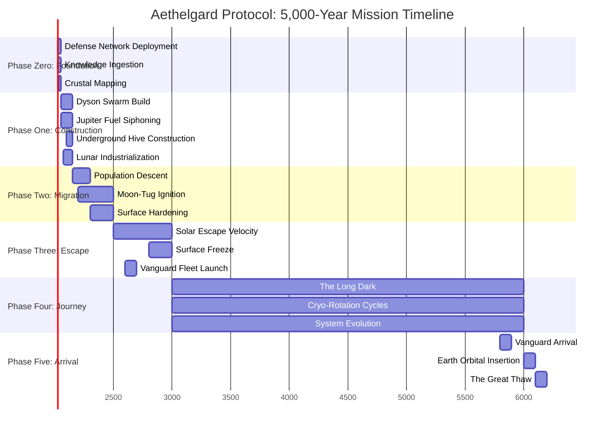

**Figure 2: The 5,000-Year Journey Timeline**

The Aethelgard Protocol unfolds across five major phases spanning 4,000+ years of preparation and 5,000 years of transit.

**Key Milestones:**
- **Year 2026:** Project initiation, Phase Zero begins
- **Year 2150:** First humans enter underground Hives
- **Year 2500:** Earth reaches solar escape velocity
- **Year 3000:** Entry into "The Long Dark" (interstellar void)
- **Year 5900:** Vanguard fleet arrives at destination
- **Year 6100:** Earth begins orbital insertion at new star
- **Year 6200:** The Great Thaw - atmosphere reactivation

The timeline accounts for:
- 150 years of construction and testing before population migration
- 500 years of gradual orbital adjustment (spiral outward)
- 5,000 years of interstellar crossing at ~0.001c
- 200 years of arrival and planetary revival
