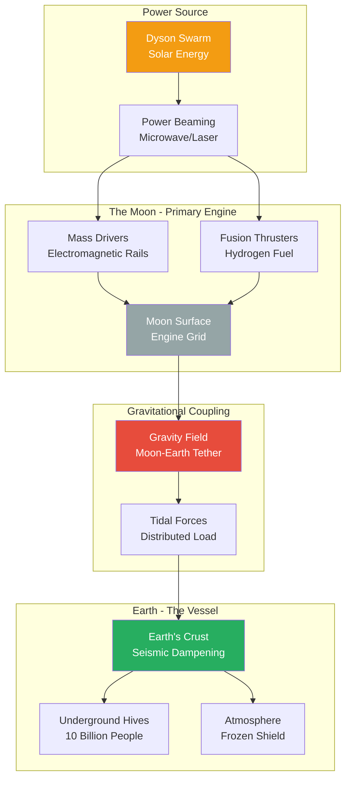

**Figure 3: Moon-Tug Propulsion Mechanics**

Rather than placing engines directly on Earth (which would incinerate the atmosphere), the Aethelgard Protocol uses the Moon as a gravitational tractor.

**How it works:**
1. **Power Generation:** Dyson Swarm harvests solar energy
2. **Power Transmission:** Energy beamed to lunar surface via microwaves
3. **Propulsion:** Moon's mass drivers and fusion thrusters fire
4. **Gravitational Coupling:** Moon's movement tugs Earth via gravity
5. **Force Distribution:** Tidal forces spread load across entire crust
6. **Protection:** Underground Hives isolated via seismic dampening

**Advantages:**
- No atmospheric combustion (preserves air)
- Force distributed evenly (prevents crustal fracture)
- Moon's engines modular and replaceable
- Gravity acts as "soft" connection (elastic tow rope)
- If Earth endangered, Moon becomes backup ark

**Key Parameters:**
- Thrust: 10¹⁵ Newtons sustained
- Acceleration: ~10⁻⁷ m/s² (gradual, safe)
- Duration: 500 years to escape velocity
- Max tidal stress: <1% of crustal shear strength
