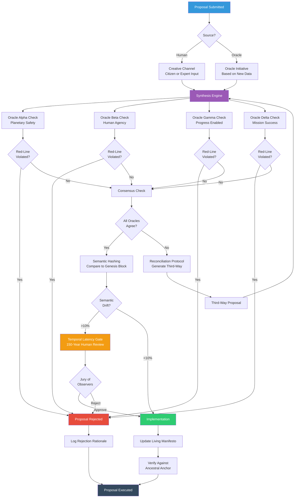

**Figure 4: Governance Decision Flow**

Every proposal—whether from humans or Oracles—follows this verification pathway:

**Stage 1: Source Identification**
- Human proposals enter via Creative Channel
- Oracle proposals triggered by new scientific data

**Stage 2: Red-Line Verification**
Each of the four Oracles checks if the proposal violates its non-negotiable constraints:
- **Alpha:** Would it harm the planet's physical integrity?
- **Beta:** Would it coerce humans or reduce agency?
- **Gamma:** Would it suppress scientific progress?
- **Delta:** Would it endanger the mission?

**Stage 3: Conflict Resolution**
- If any Oracle rejects: Proposal fails
- If Oracles disagree on details: Reconciliation Protocol generates alternatives
- If all agree: Proceed to drift check

**Stage 4: Anti-Drift Verification**
- **Semantic Hashing:** Compare proposal to 2026 Genesis Block
- If drift >10%: Trigger Temporal Latency Gate (150-year human review)
- If drift <10%: Proceed to implementation

**Stage 5: Human Oversight**
- Jury of Observers can force review of any decision
- Major changes require multi-generational consensus
- All decisions logged for transparency

**Stage 6: Execution**
- Living Manifesto updated with rationale
- Changes verified against physical Ancestral Anchor
- Implementation proceeds with monitoring

This multi-layer process ensures no single entity—human or AI—can hijack the mission.
